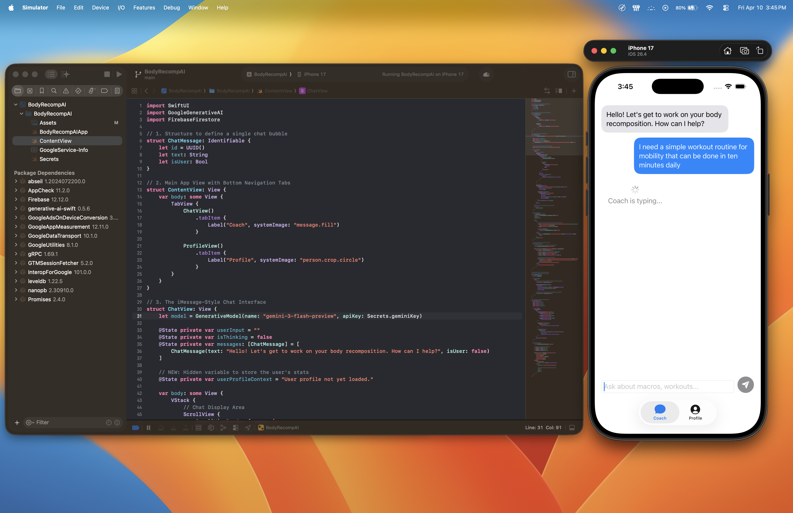
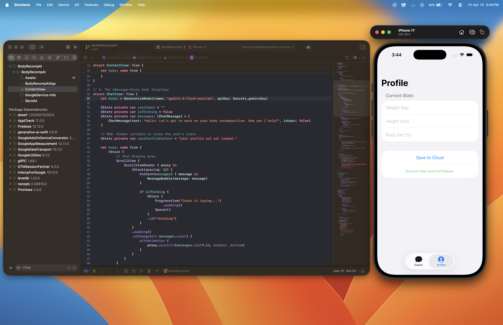
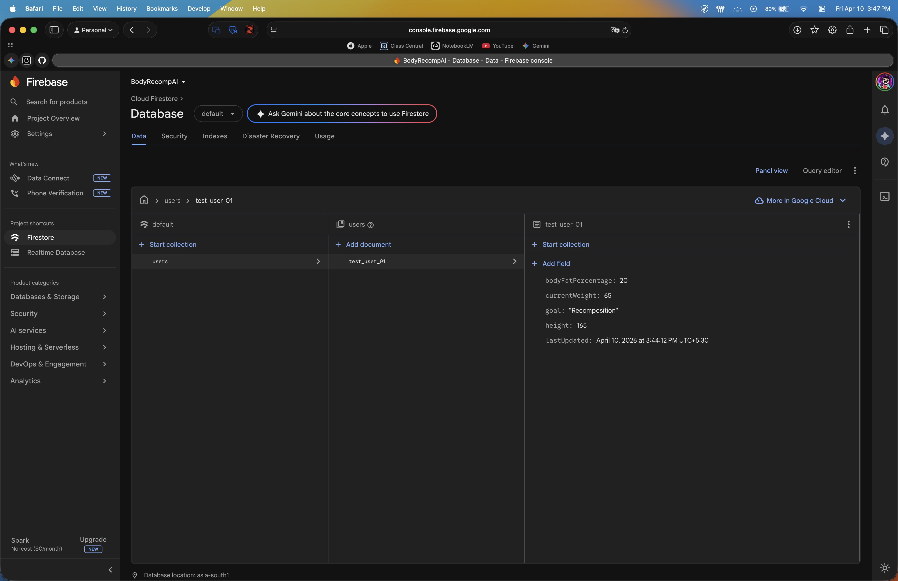
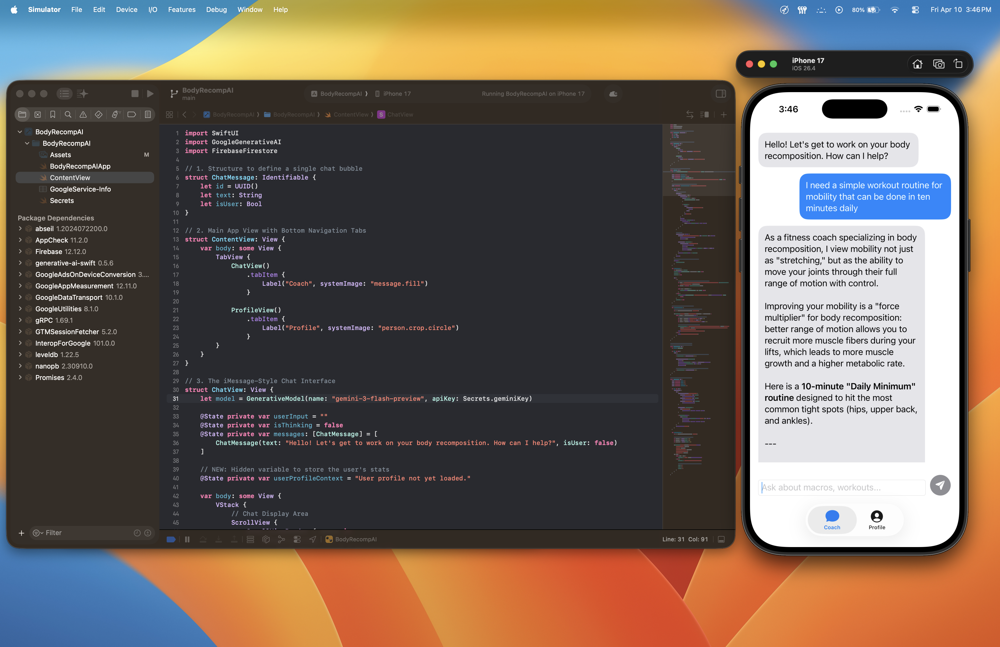

# BodyRecompAI 🏋️‍♂️🤖

An AI-powered fitness coach designed for body recomposition. This app provides personalized advice on macros, workouts, and fat loss based on user-specific metrics.

## Features
- **AI Coach Interface:** Real-time chat with Google Gemini for personalized fitness guidance.

- **Dynamic Profile:** Save and load weight, height, and body fat percentage.

- **Cloud Integration:** Uses Firebase Firestore for real-time data synchronization.

- **iMessage UI:** Clean, modern chat bubble interface with markdown support.


## Tech Stack
- **Language:** Swift (SwiftUI)
- **AI Brain:** Google Generative AI (Gemini 3 Flash)
- **Database:** Firebase Cloud Firestore

## Setup (For Reviewers)
To keep the project secure, API keys and Firebase configuration files have been `.gitignored`. To run this project locally:

1. **Firebase:** Add your `GoogleService-Info.plist` to the root directory.
2. **API Key:** Create a file named `Secrets.swift` and add:
   ```swift
   enum Secrets { static let geminiKey = "YOUR_API_KEY" }
